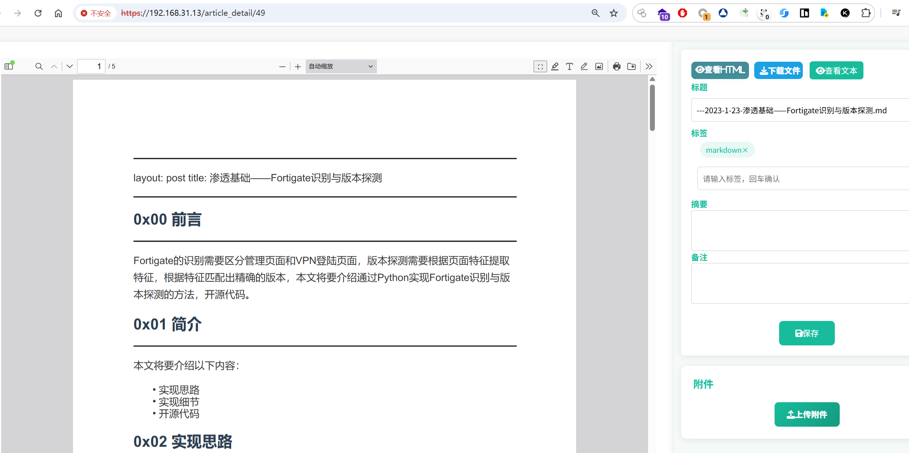

# 

   “典藏” （Trovelocal）是一个为孤狼玩家和中小型团队打造的**轻量级本地知识库系统**，可以在低成本硬件条件运行。与众不同的是，我们没有直接接入AI大模型做RAG或KAG。我们认为，平民化且效果出众的解决方案依旧还在路上。如今AI的发展日新月异，新型的高效算法和更长的上下文窗口长度在持续进步，每个月都有一些技术被突破或是被否定，还远远不到稳定落地和工程化的那天。在不远的将来，个人在消费级硬件上能部署令用户满意的AI模型时，我们会顺势接入。而不是把普通用户的电脑内存占满、把CPU和GPU烧得滚烫，占用大量运行资源使得别的工作都做不了，只为了部署一个本地的“人工智障”大模型。Trovelocal 在为那一天准备着，它像一艘诺亚方舟，承载你现有的知识。即便世界末日来临，只要带上它，就还能东山再起。


## 特点

- 🔎支持多类型文件内容的**全文检索**、精准匹配、模糊匹配，可达到**毫秒级响应**。
- ✨搜索时，支持**显示关键词**在文档中的**段落上下文**，高亮关键词
- 👁️‍🗨️支持**在线浏览**文档，包括浏览office类文档、pdf、html、视频和音频（**在线播放**）、图片、压缩包（目录结构）、md、eml等。
- 📰支持文档正文**内容提取**，如office类文档（**doc、docx、xls、xlsx、ppt、pptx**等）、**pdf、md、eml、txt、压缩包**（目录）
- 📞支持把**音频、视频转换为字幕文本**并参与全文搜索（字幕格式为 ”<时刻>:<说话内容>“ ）
- 💾支持上传**所有格式**的文件（**不限大小**），包括office类文档、pdf、html、eml、md、视频、音频、图片、压缩包、可执行程序。
- 🛠️提供 **MCP Server**，可联动Cline等客户端工具把你的**私人知识库**的数据**接入AI大模型**，提升AI对你专业领域的回答能力。
- 🖥️内置samba，支持**映射SMB**为Windows网络磁盘，获得**如同操作本地文件的丝滑**快感：
  - **粘贴即上传**。文件粘贴后，自动同步系统后台，文件内容自动提取，然后就可以全文检索
  - SMB目录中的文件，可以用Windows本机的客户端软件直接打开、浏览、编辑，例如：
    - 支持**保留文件夹结构**，可以直接把你的个人笔记文件夹复制到SMB目录下。
    - 目录中的**视频**，可自动由系统安装的播放器进行播放，避免出现Web端上的编码问题等
    - 目录中的**办公文档（office类）**，自动使用系统安装的文档编辑器打开，如使用wps和office可直接浏览和编辑
    - 目录中的**Markdown**文件，可用系统本机的notepad++、typore等md编辑器直接打开和编写
    - 使用golang编写的**高性能文件监控**功能，**文件内容变化可以立即同步**系统
    - 对于本地局域网用户，可以直接**当作NAS使用**；对于**远程用户，可以使用Web端**进行文件上传、浏览、内容检索

- 🌐支持**爬取url保存为html**（通过singlefile+chrome**渲染完整页面**），内容、图片、布局完全一致，并能在系统中直接浏览。
- ⬇️对于爬取的网页中的**github链接**，自动提取url并使用github api **下载项目压缩包（.zip）**。
- 🛵支持**singlefile的浏览器扩展**，可直接保存当前页面到系统中（方便快捷，且能收藏某些需要登录才能访问的页面）。
- 🔧自动**转换**上传的文档为**pdf和html**。转出的文件能用作在线预览，也能配合浏览器的AI扩展（如kimi）实现网页内容总结、AI对话
- 🔗支持对收藏的主体**上传附件**，比如上传了一个”c语言数据结构.mp4“后，可以把对该视频的学习笔记docx上传为该视频的附件。
- 📌支持**标签**，可以在”上传文件/爬取url“时设置标签，并可通过标签来检索文件
- 🛒支持rss，可配置rss地址，**自动通过rss收藏新的网页**，系统每90分钟获取一次rss内容，爬取新发布的url链接
- 🛡️支持批量上传、**超大文件分片上传**，分片提交失败时自动重试，以应对复杂的网络环境
- ⚙️系统所有需要网络交互的功能都可以**配置代理**（http/socks5），如网页爬取、github项目下载。
- 🔌支持通过**API**来上传文件或提交待爬取的url，你可以通过外部程序来推送需要爬取的url或上传新文件。
- 📣**系统功能扩展**。用户可以凭借目录下的cron/文件夹，放入你想要的python插件以扩展系统的功能。cron/下的所有子目录里的python脚本将定时执行。系统的rss推送功能就是以插件形式放在这个目录下，你完全可以用python在这里扩展任何新功能，例如运行可执行程序、推送系统数据到第三方平台、获取外部任意来源的数据添加到系统等等。如果你愿意，你甚至可以在后台配置singlefile地址为你的外部程序的api接口，并使用你的外部程序来爬取网页和返回html给系统（如果你不喜欢singlefile爬取完整的页面，你可以用自己的爬取程序只返回文章内容（经过清洗）而不保留样式、结构等信息），你只需要遵循这个接口的提交和响应格式即可（参考目录下的singlefile/webserver.py）。

## 适用场景

- **网络安全从业者**。作者本身就是网安从业者，开发这个项目的初衷，就是因为经常遇到某些公众号文章、github项目突然消失，如果你经常看到这些字眼，我相信你一定与我感同身受：

  - **404**
  - **该内容已被发布者删除**
  - **此内容因违规无法查看**
  - **此内容因违规已被删除**
  - **接相关投诉，此内容违反《互联网用户公众账号信息服务管理规定》**
  - **该内容已被投诉且经审核涉嫌侵权，无法查看**
  - **您下载的资源因违规被禁止下载**
  - **此账号已被封禁，无法访问**
  - **Repository unavailable due to DMCA takedown（因 DMCA 删除请求导致仓库不可用）**

  身为网安从业者，自然难以相信任何云盘、云文档、云笔记，你不知道它们什么时候跑路或者宕机，你也不知道你的数据上去以后会去哪里，你更不知道你的文件有一天会不会被”违规“、”404“、”禁止下载“、”**被**删除“。你只能相信你自己。

  细心的你应该注意到，为什么系统有一个”github项目自动下载“功能，因为你可能再也找不到哪个正经行业像我们一样，如此频繁地遭遇404、内容违规这样的亿点~小问题🤡。

  如果你受够了0day从你眼皮底下消失，就因为你没有把握住仓库发布的那15分钟；如果你受够了浏览器收藏夹、微信收藏里的公众号文章在你需要的时候突然报出404；如果你也一样....欢迎乘坐诺亚方舟。

  使用典藏，你可以搭建个人/团队的网络安全知识库，配合第三方采集工具，持续跟踪收集最新的网络安全资讯、收集第一手的CVE漏洞信息、监控和保存github项目（安全产品、新发布的0day漏洞）。如果你有脑洞，你甚至可以扩展它的用途，设想一些场景，例如当你在内网采集到一大批需要快速分析和搜索全文的docx、xlsx、pdf、txt、conf，又例如你有一大批需要分析的eml邮件，导入典藏后，使用mcp结合本地ai做邮件内容翻译和分析，快速获取需要的信息（如信件内容中包含密码的），或根据近期邮件内容编写一份定制的dy邮件...

- **法律行业/医疗行业/程序员/中小型公司**等，需要储藏大量的、不同格式的专业文档，支持标签分类和毫秒级的全文检索。

- **数据囤积者**，制作私人数据仓库，**休闲娱乐当NAS，办公检索查资料**。

- ...

## 功能介绍

功能演示视频：

【敬请期待】

### 1.全文检索

- 支持**傻瓜检索**。选择下拉菜单，可选择这些字段进行搜索（内容、标题、标签、摘要、高频词、备注、文件名、用户名、上传时间）

  

  查看所有关键词匹配的段落：

  

- 支持**高级检索**：使用检索语句查询想要的文档。点击系统左上角“检索说明”查看语法说明书。

  

  也可以直接查看项目目录下的 [检索语法说明.md](./检索语法说明.md) 。
  
  下面是一些查询例子：

| 搜索意图                                                     | 查询语句                                        |
| ------------------------------------------------------------ | ----------------------------------------------- |
| 查找文档内容有“更新”且上传者是“admin”                        | content:更新 && user:"admin"                    |
| 标题中有“API”或文档内容有“接口”，并且文档创建日期为2025年5月的某天。 | (title:API \|\| content:接口) && date:"2025/05" |
| 精确匹配标题为“安装手册”的文档                               | title:"安装手册"                                |
| 搜索标签为”技术笔记“，并且文章内容绝对包含”代理“两个字的文档 | tag:技术笔记 && "代理"                          |

- **排序**：可以按照日期的先后进行排序，以方便用户查找最近收藏的文章，或是最早收藏的文章。

  

### 2.在线预览

这个功能我们做了很多技术调研和测试。最终我们选择了利用**libreoffice**强大的兼容性，把**office类办公文档转为pdf**（md文件则额外处理为pdf），**结合pdf.js**进行web端的在线浏览。

我们没有选择谷歌docs/微软等在线预览文档的接口，因为这会把文件提交到它们的服务器。也没有选择kkFileView、OnlyOffice这类文档在线预览编辑的解决方案，因为性能要求太高，开几个文档就占了快1G内存，显然不适合小型设备或者低性能的VPS。

我们选择**配合SMB**，把文档交给专业软件（Office、WPS、Typore、Adobe Acrobat）去查看和编辑，把音视频交给用户系统所安装的任何播放器去播放（没有web上的编解码问题），专业的事情就交给专业的客户端软件解决，这不香吗？并且不会占用服务端的CPU和内存。

系统的web端，目前支持在线浏览的文件如下（预览的是这些文件转换后的pdf）：

- **pdf、html、md、eml（仅文字）、txt、代码源文件**
- **7z、rar、zip、tar、tar.gz、tgz、tar.bz2、tbz、tbz2、tar.xz、txz**
- **doc、docx、dot、dotx、dotm、rtf、odt、ott、odf、xls、xlsx、xlsm、xlsb、xlt、xltx、xltm、csv、ods、ots、ppt、pptx、pptm、ppsx、pot、potx、potm、odp、otp**

以下简单展示一部分：

- **Markdown预览**

  

  

- **doc/docx预览**，我们修改了pdf.js添加全屏按钮。你还可以搜索文档内容，找到自己感兴趣的段落。

  

  

- **HTML预览**。点击”查看HTML“（PS：几乎所有文档格式都可以被系统转为HTML进行预览）

  

  点击后，跳转到系统保存的HTML：

  

  

- **压缩包预览**。能查看压缩包里的所有文件/文件夹，压缩包目录可以点击展开或收起，里面的文件名/文件夹名也可以全文检索到。

  

  

- **视频/音频预览**。播放4k视频，支持全屏、快进、拖拽跳转时间段。视频播放采用html5的video标签，有局限性，经测试能播放mp4、mov、mkv，其他的如avi不行。若视频的音频编码采用cc3将没有声音（浏览器不支持解码），可以点击右侧”修复视频声音“尝试修复，系统将会尝试转码声音为aac，但转码需要点时间，耐心等待。

  

  视频转文字功能。点击右侧的”声音转文字“按钮（需要先在后台配置好[voice2text](https://github.com/killmonday/voice2text)服务器地址，该项目专门为典藏提供声音转文字功能），等待转换完成即可。成功后，按钮变为”转换成功“，此时点击右侧的”查看文本“，即可看到转出的字幕文字。

  


查看视频**转换出的文本（字幕）**：


- **爬取的网页**预览

  在收藏条目的详情页，点击“查看HTML”，即可跳转。首先点击标题，进入详情页：

  
  
  
  
  点击“查看HTML”：
  
  
  
  

如上图，凭借singlefile，可以获得几乎与原文完全一致的页面，里面的文字、图片都可以选中和复制。


### 3.Web端收藏文件/URL

首先进入后台管理：


- **批量上传文件**。支持大文件传输（目前测试过传输5.3G的视频文件，理论上更大也没问题），因为系统会分片上传，遇到网络错误会自动尝试重传（默认1000秒内网络未恢复则失败）。注意：由于libreoffice转换文档格式时会整个读入内存，所以如果你有特别大的docx、pdf（>200MB），你需要适当增大服务器内存，否则可能失败。

  批量上传的文件可以设置多个标签，但不能设置标题、摘要等，因为没有意义，比如这100个文件为什么会同一个标题呢？因此系统自动取文件名作为收藏条目的标题。

  

  

  暂不支持选择文件夹，但可以全选某一目录下的所有文件，如下图：

  

  

- **添加批量URL收藏**

  

- 爬取功能的**代理设置**

  

- 爬取的**代理白名单**设置

  对于国内的一些网站，如果你使用代理网络去爬取，反而会更慢，甚至无法访问。

  因此你可以设置某些域名下的URL不需要使用代理去爬取。
  
  

### 4.SMB映射和同步

- 设置SMB密码

  如果你使用的是下文“部署”章节里我的ubuntu虚拟机，里面的容器已经配置了默认的smb密码，用户名是root，密码是`babahaoshuai`

  执行下面的命令可以添加或重置密码（用户名就写root，用root是因为没配置权限，其他的用户可能无法访问到目录）：
  
  ```
  docker exec -it <id> smbpasswd -a root
  # 容器id需填写diancang_run容器的id
  ```


- 在windows上映射SMB为网络磁盘

  

  填写典藏服务器的ip地址和共享名（share），如 \\\192.168.31.13\share


输入账号密码（root / `babahaoshuai`），登录后就映射成功了：


- 注：**使用WSL部署无需映射SMB**，因为windows上可以直接访问WSL虚拟机的linux文件系统，复制文件到这里，同样能被监听和同步到系统后台。**推荐您使用WSL+ubuntu22.04+docker部署典藏**系统，WSL的文件访问性能比SMB更好更快，经过我的测试，SMB在局域网、垃圾百兆路由器和Wifi2.4G下只能达到50MB/s的写入速度，但是**WSL可以达到500MB/s的速度（也取决于你的固态有多快）**。你只需要在windows上访问项目目录下的knowledge_base/smb目录，这里就是被监听的目录了，想收藏的文件/文件夹直接粘贴到这里就行了。

  

#### *SMB目录的重要提示

在SMB目录下，非必要的时候，**不要重命名一个存在有文件或者子目录的文件夹**。对于一个没有存放东西的空文件夹，则可以随便更改名字，不会造成任何不良影响。

这是因为你对“文件夹重命名”后，我们并未对数据库和meilisearch中的文件路径进行更新，在web上您将会无法下载原始文件（虽然你依然可以检索全文内容和查看文档转出的pdf）。如果你必须重命名一个存放了东西的文件夹，你现在可以这么做：**创建一个新的文件夹，名字设置为你想要的名字，然后把旧文件夹里的所有东西剪切到这个新的文件夹中，最后删除旧的文件夹，这样数据库和meilisearch能保持同步并能持续监听这个新目录下的文件的变化**。

我们没有为文件夹的重命名做出响应，是因为“一个文件夹”和“一个文件”不同，文件夹A下可能嵌套有多级子目录和多层的文件，甚至非常多，有成百上千个，需要遍历原来的所有文件把它们的路径修正为新的路径，如果在修正的过程中，你对这个已经重命名为B的文件夹里的子目录C又进行了重命名，那么甚至可能造成两次修正过程的冲突，还需维持更新的原子性，这种方式我觉得很麻烦也不优雅，性能也低，在我们想出更好的解决办法前，我们不会对文件夹的重命名做任何操作。如果您有相关经验和好的建议，可以提交一个issus，谢谢！

### 6.Github项目自动下载

对于你收藏的那些URL，页面爬取入库后，系统会自动解析提取页面中的github链接，并使用http api + github token把这些github项目下载到系统中，成为你收藏的这个网页的附件。你可以在后台配置你的github token和每个页面中应该下载多少个github项目（以免硬盘爆炸，有一些项目占用的空间很大）。


Github API 目前限制为每个注册账号每小时内调用不超过5000次（更详细的限制请查看官网），假设一个项目你只需要1秒就能下载完成，一个小时也只能下到3600个项目，达不到5000次，足够你用了。如果你忘记了在后台配置github api token，那么你可能只能下载5个左右的项目就会被限制下载，什么时候恢复我就不清楚了。

下载的github项目压缩包可以在后台的“GIT下载管理“页面查看：


也可以在收藏的条目的详情页里的附件位置查看到：


### 7.自动爬取RSS发布的url链接

RSS订阅推送网页到系统，是以插件形式提供功能。项目目录下的./cron/cron.sh将会每隔90分钟递归遍历./cron路径下的所有子目录，执行里面的python脚本。rss插件的位置就在./cron/rss/rss_plugin.py，它运行时会获取rss.txt里的rss地址，获取最新文章的信息（标题、摘要、URL），通过api推送到典藏系统。但我默认注释了cron.sh里的运行python脚本的语句，当你需要时，你可以解除注释并重启docker容器。

### 8.API演示

- 想用第三方程序**获取收藏的主体的全文内容**、根据关键词检索文档，你可以直接用7700端口**通过meilisearch来查询**和访问，此处参考meilisearch[官方文档](https://www.meilisearch.com/docs/reference/api/search)即可，几乎每一种开发语言都写了例子，非常简单。

- 而典藏提供的API，包括：**添加收藏文件**、**添加要收藏的URL**、**为某个收藏主体添加附件**。相关例子已经写在./api_example.py中，直接拿来用即可，你只要先到后台的“认证管理”->“Bearer Token管理”，添加一个典藏的api token，然后修改到脚本中就行了。

例如上传一个docx文件到系统中，并设置标签为“api“、“例子”：


### 9.MCP调用演示

MCP服务器代码从 [meilisearch_mcp](https://github.com/killmonday/meilisearch_mcp) 项目获取，这是我们专门为典藏系统编写的打造的mcp服务，目的是通过meilisearch为大模型提供私人知识库的专有知识，提升大模型解决专业领域问题的能力。

- 启动mcp服务器

  修改utils.py中的meilisearch服务器地址和api_key（MEILI_URL、MEILI_API_KEY），然后运行


- 按照项目页的readme，在vscode中添加我们的mcp服务器

  

- 提问例子

  问：从mcp查询 fortigate版本识别有什么办法

  

  回答：

  

  引用的是典藏中收藏的文章：

  

### 10.浏览器扩展

典藏可以配合singlefile浏览器扩展对你正在浏览的网页进行一比一的完美收藏，好处是不用打开典藏系统去手动添加URL，并且这种方式能够收藏那些需要登录认证和会员才能访问的文章、页面，比如微博文章、知乎等。

- 首先，在你的浏览器应用商店中安装singlefile扩展（支持火狐/谷歌等），略。

- 进入singlefile的配置

  

  

- 进入“保存位置”选项卡

  

- 配置“保存到REST表单API”这个位置。把网址设置为典藏的url（加上api路径/singlefile/add，如果你没有一个域名和有效的签发证书，你需要写http而不是https，否则不成功），授权令牌填写后台默认的 `cQTXL8hS9ig5Gc1WFEst4ERUXX3Oi_` ，你也可以在“Bearer Token管理”自己添加新的token。文件字段必须填写content，网址字段必须添加url。填写后，鼠标移出文本框，在窗口的任意空白位置随便点击一下，再关闭窗口即可，singlefile自动已经保存了，它没有确认按钮的😂。

  

  接着随便打开一个网页，右键选择singlefile，点击保存网页，就等把网页收藏到典藏系统里了：

  

  回到系统后台，已经添加好了，由于singlefile扩展是直接把浏览器中的页面内容发送到典藏系统，所以很快。

  

  在检索前台刷新一下，已经能看到这条收藏：

  

  查看收藏下来的网页内容，一摸一样并且完整：

  

### 11.文档内容+AI分析

对于每个收藏的文档，在它的详情页都会有“查看文本”或"查看HTML"按钮，你可以点击后查看文档的纯文本格式，如下图：


你可以在查看内容的页面，使用各种AI的浏览器扩展（如Kimi浏览器助手），对当前页面中的内容进行总结、提问，如下图：


### 12.微信收藏导入典藏

不可否认的，微信公众号文章是目前我们获取最新资讯的最常用和最便捷的通道，因为我们都有手机，我们也都有微信，当你在地铁上通勤、在高铁上出差、在食堂排队打饭、等电梯，刷刷微信公众号文章既能打发时间，又能获取最新的行业消息，每当看到有价值的文章我都会收藏到微信收藏中，并打好标签。遗憾的是，我只能在微信中搜索标签和文章的标题，却不能搜索文章内容。

既然微信公众号是我们主动获取信息的重要通道，收藏到的这些文章必定是重要的、有价值的、被自己整理和打标签的，而不是自动爬取的那些可能对自己无用的文章。我的微信收藏现在已经保存了有6K+的文章，浏览器收藏的网页有8k+，都是这些年浏览过的重要的、有价值的知识和信息。这些收藏，大约有30%已经永久的消失在互联网上，由于一些不可抗力因素。

那有没有办法，把微信收藏里的文章导入典藏呢。聪明的你应该猜到了，当然可以。但由于我打不过南山必胜客，所以你只能自己解决这个问题。

## *免责声明

本项目仅限用于个人用于收藏和整理自己的文档、搭建本地NAS系统，方便自己的个人生活和研究学习。**使用者应遵守法律法规**，任何不当使用造成的后果由使用者自行承担。

我需要再次提醒您，您抓取的数据**仅用于个人收藏和学习**，**不能用于商业牟利、不正当竞争、诈骗、诽谤等非法目的**；**未经数据来源方书面授权，不向第三方提供、出售或公开数据**。您对本系统的使用，**不能干涉第三方信息系统的正常运行，例如不能对第三方信息系统造成DDOS、影响其用户的正常使用、造成服务短暂中断或数据丢失，不得危害网络安全**。因您个人擅自修改或滥用程序导致的违法违规行为，需要使用者自行承担。

## 部署

### 直接下载部署好的虚拟机

- 下载ubuntu22.04-server虚拟机

通过网盘分享的文件：trovelocal
链接: https://pan.baidu.com/s/1zRXAZAwJW0qvEsAXgYZz8w?pwd=gvsy 提取码: gvsy 

- 通过ovf文件导入到vmware

  

  

  

- 开机

  导入成功后，打开虚拟机。ubuntu是无图形化的server版本，默认配置了4核4G，最低建议2核2G没问题（并去后台设置所有线程并发数为1）。

  

  **ubuntu登录账号** root `123`

  登录后，开机任务会自动启动典藏的docker容器，大概等待30秒左右就能访问系统了（**你需要登录一次ubuntu系统**，因为我写的自启动放在/etc/profile.d里，不登录不会执行）。

  然后使用ifconfig查看一下虚拟机的ip地址，使用nat地址或者桥接的ip地址都可以访问，直接访问 https://ip:443/即可（使用http访问80也是可以的，两个协议都配置了。http主要是用来给singlefile的浏览器扩展用，因为这个扩展如果配置的接口地址是自签名的https证书就无法使用，懒得配置域名和证书的小伙伴就用http来配合singlefile浏览器扩展就行了）。

  **系统web端的登录账号**是 admin `admin`。

  

### Docker部署

- 在安装了docker的机器中下载本项目

  ```
  git clone 
  ```

- 进入项目目录，解压mysql_meilisearch_data.tar.gz，这里面是一份干净的初始化好的mysql数据库和meilisearch索引文件

  ```
  tar xf mysql_meilisearch_data.tar.gz
  ```

- 运行docker-compose

  ```
  docker-compose -f remote.yaml up -d
  ```

  这会从远端docker仓库拉取镜像并运行。如果拉取docker网络存在问题，也可以直接从百度云下载我的ubuntu虚拟机，虚拟机里已经部署好了，需要镜像的话，/root下也有docker镜像，导入时可执行`gunzip -c diancang_img.tar.gz | docker load`。

### WSL部署

使用WSL2需要升级你的Windows版本为专业版以上，对系统的版本还有一些要求，最好是Win11（任意版本）或Win10的最新版本。

家庭版似乎也能安装WSL，但我并没有成功，所以我是更换了本机Win11的密钥为专业版密钥后，重启升级为专业版了，这不会造成本机已安装的程序和个人文件夹数据丢失，只是系统变为了专业版，你也可以像我这样做。


- 开启WSL功能

  管理员执行下面的命令：

  ```
  dism.exe /online /enable-feature /featurename:Microsoft-Windows-Subsystem-Linux /all /norestart
  dism.exe /online /enable-feature /featurename:Microsoft-Hyper-V-All /all /norestart dism.exe /online /enable-feature /featurename:VirtualMachinePlatform /all /norestart dism.exe /online /enable-feature /featurename:Microsoft-Windows-Subsystem-Linux /all /norestart
  dism.exe /Online /Enable-Feature /FeatureName:VirtualMachinePlatform /All
  ```

  或者在“启用或关闭windows功能”（或命令行执行OptionalFeatures命令打开 ），然后开启“适用于Linux的Windows子系统”、“Hyper-V”、“[Windows 虚拟机监控程序平台](https://zhida.zhihu.com/search?content_id=254474774&content_type=Article&match_order=1&q=Windows+虚拟机监控程序平台&zhida_source=entity)”和“虚拟机平台”。

- 打开windows更新功能，然后允许“接收其他Microsoft产品的更新”

  

- 安装和更新WSL

  ```
  wsl --install 
  wsl --update
  wsl --set-default-version 2
  ```

- 配置桥接模式网络、最大内存等

​	进入windows当前用户目录（c:\users\xxx\），在此目录下创建文件“.wslconfig”，内容如下：

```
[wsl2]
networkingMode=mirrored
dnsTunneling=true
firewall=true
autoProxy=true
memory=16GB

[experimental]
autoMemoryReclaim=gradual
hostAddressLoopback=true
```

cmd中执行wsl --shutdown 关闭所有虚拟机，**等待8秒**后才能重新运行虚拟机（现在没有就运行虚拟机就不用）。

- 安装ubuntu22.04

```
wsl --install -d Ubuntu-22.04
```

- 在Windows的搜索栏，搜索terminal，然后管理员运行“终端”

  

  在Win11的终端（**Terminal**）中，可以在这里打开WSL虚拟机：

  

- 在WSL的ubuntu22.04虚拟机中安装docker（略）

- 下载本项目，进入项目目录，解压`tar xf mysql_meilisearch_data.tar.gz`，然后执行`docker-compose -f remote.yaml up -d`（当然，如果网络有问题，你可以从我百度云的ubuntu虚拟机中拷贝/root目录下的三个镜像文件到WSL虚拟机中导入docker镜像）


## 技术栈

- 前端：bootstrap
- 后端：python+django
- 中间件：nginx、uwsgi
- 缓存：memcache
- 全文检索引擎：meilisearch
- 数据库：mysql
- 文件内容处理：python、extractous、jieba
- 文件格式转化：libreoffice、python
- 文件浏览：pdf.js
- 文件监控：golang+fsnotify

## TODO

- 对于网页爬取，有时候或许还想要把**网页中的视频/音频下载**下来，我们后续会研究一下。
- 升级meilisearch索引为混合检索模式（**向量检索**+全文检索），当前版本的程序只支持全文检索，如果用户搜索的关键词没有出现在文章中，是搜索不出来这篇文章的。而向量检索，则可以做到这一点（当然，某些情况下，也可能是负优化的检索结果），因此混合检索将两种搜索方式结合在一起使用。但是，把文本进行向量化是一种计算密集型的任务，经过测试，我的笔记本标压i5-12500H在处理100KB的文本内容转换为仅仅784维度的向量，用时就超过10分钟，太慢了。。。暂时搁置。
- 调用AI，根据收藏的文章内容**自动打标签**。
- 自动同步各类线上平台的笔记->典藏系统中，如飞书、坚果云、有道云、语雀、印象笔记、notion、obsidian等。
- 使用一个小模型，对批量文档进行**翻译**，有一些文档是英文或其他语种，把它们翻译为中文版本
- ...

## 开源计划

您可以免费使用典藏项目，容器中的保存的是nuitka编译后的.so机器码文件。目前项目正在积极开发，如果使用中有bug欢迎您提交issue。未来的代码结构和逻辑可能有调整和迭代，甚至重构，后续也会上线一些新功能，到时候整理好了会开源出来。这个项目是我们为了解决自己的需求手搓出来，如果不适用于您的场景，您可以出门寻找更适配的解决方案。我们发布出来，一是有成就感，二是给有同样需求的小伙伴解决问题。如果您喜欢本项目，欢迎点个小星星⭐支持一下，如果很多小伙伴喜欢我们的项目，我们也可以提前开源出来。

## 错题集

每当一个项目结束，我们喜欢用错题集记录这个过程中那些令人印象深刻的”错题”，这样可以避免再次踩坑。如果你想开发类似的程序，也许会对你有帮助。

- 文档转化
  - 多进程使用libreoffice进行文档转化，可能会造成soffice.bin进程转换失败，但是却不输出任何东西，标准输出和标准错误输出都是空，相对的，如果它转换成功，标准输出会有打印从xxx转换到xxx成功，如果失败会有错误输出。这种异常的情况（大概率是转为html或text时发生），暂时不知道是什么原因，AI的解释是可能是未捕获的内部异常导致崩溃。我们甚至不使用无头模式，而是换成打开文档，执行一个我们编写的office宏代码来导出文档内容，即便这样在多个进程并发时也会出现这个无任何输出的失败情况。而我们检查了资源占用和内核消息，也没有找到任何头绪，不可能是OOM，因为内存足够。我们也懒得使用strace来调试soffice.bin进程的行为，即便我们知道了原因，这也是libreoffice的问题，只能它的开发者去维护了。为了解决这个问题，目前暂时只能限制libreoffice转换文档的线程是1，你在典藏后台设置的文档转换线程其实只是提取文档内容的线程，不会影响文档转换。如果你知道这是什么问题，欢迎告诉我。
  - Libreoffcie把文本文件（如.txt）转为pdf时，如果文档中有中文（可能是GBK或GB2312或utf-8等），转出的pdf几乎都是乱码，比如我们把鲁迅的《狂人日记》txt转为pdf就是中文乱码，它似乎无法正确识别文本文件的编码格式。经过学习，我们了解到其实并没有100%准确地确定文本编码的办法，现有的手段都是靠统计概率、语言模型的匹配等。比如一个txt中只有“1234”这四个字符，它们的ASCII编码形式的存储和UTF-8编码形式的存储是一致的，你怎么知道是ASCII编码还是UTF-8编码呢？为了解决这个问题，我们先识别文本文件的编码，如果不是UTF-8或ASCII则转为UTF-8，转完后重新检测，如果编码变为UTF-8说明这是一个有效的转换，否则说明这个文本没有转换必要（可能全是ASCII字符）。对成功转为UTF-8的文本再使用libreoffice转换为pdf，则不会出现乱码问题。
  - libreoffice目前体验来看，把文档转pdf基本上没有问题，几乎百分百成功，效果也很好，但是转为html格式，则有些时候转出的html不完整，缺少图片等。后续可以找一个更好的转html或markdown的办法。
  - 对于富文档文件，libreoffice转出的pdf效果很好，但前提是你需要安装好字体库，如果你的源文件中有中文，libreoffice的运行环境又没有中文字体库，那你必定转出的pdf里带乱码。你可以把Windows上的字体库拷贝到服务器中，从C:\Windows\Fonts目录下复制所有文件到/usr/share/fonts/chinese/TrueType/（先创建mkdir -p /usr/share/fonts/chinese/TrueType/），然后执行fc-cache -fv 更新字体库。
- 文件监听
  - fsnotify的官方文档没有提及一个坑点，那就是事件触发时，操作系统也许并没有真正处理完这个操作，比如文件夹的创建也许在100毫秒后才创建成功，在文件夹没有创建之前，添加到watcher是不会成功的，而fsnotify对于不存在的文件夹的添加没有任何异常和报错。
  - 我们最初打算采用内核级的fanotify事件通知机制来实现文件行为的监听，因为inotify需要为每个监听对象耗费一个描述符，如果你有百万级的文件和文件目录，这个消耗可能是巨大的，需要大量CPU和内存资源。但经过研究和实践，fanotify不能关联文件MoveTo和MoveFrom，对于重命名的目录或者文件，并不知道是从A变成B，只知道A没了，B出现了，虽然事件的时间能产生一定关联，但如果同一时间发生大量同类型事件，就没办法说一定是A变成了B。
- Meilisearch全文检索
  - Meilisearch在做全文检索时，如果使用了attributesToCrop（指定某个属性在返回时进行裁剪，只返回全文中被关键词击中的相关片段）来获取关键词匹配的上下文片段，这个功能在大文本下有严重的性能问题！我们仅仅使用一个30MB的txt文件进行测试，随便一查询，就能让meilisearch的响应从 **百毫秒 干到 10秒**。经过严格的控制变量测试，最终我们锁定了就是attributesToCrop的裁剪功能造成了性能的严重损失。遗憾的是我们没法去维护它的rust代码。既然知道了问题，那就简单了。我们不再使用attributesToCrop裁剪，而是自己实现了在检索中展示关键词出现的上下文段落（可以展示任意多个，而meilisearch只能展示一个），并进行了优化，速度极快，同一个30MB的文本，也只需要毫秒级的运算，我们让全文检索再次回到了毫秒级的丝滑体验。

- Github项目下载
  - 部分github项目的默认分支是master而不是main，如果你使用main下载报错找不到的话，你应该先用github api获取项目信息，在里面能找到仓库的默认分支名字，用这个去下载就ok了。
- 文档内容提取
  - 我们使用了extractous，基于rust实现的文档解析工具，它比python的unstructured更快、内存占用极低。但它依然存在一些问题，比如一些文档提取不出内容、报错，它的底层实质上使用了Apache tika，并对tika进行rative编译出的动态链接库进行调用，所以实际是tika在报错。我们根据仓库里的issus，把开发者未修复的一些bug解决了，并重新编译了动态链接库，现在它能处理更多的文档，但我们不可能够解决在所有文档上的解析问题，依然会有一些文档无法提取内容，这是正常的。所以典藏里的Plan B是使用python把这些无法提取内容的文档的pdf进行内容提取，基本上对pdf的文本提取是没有问题的。

